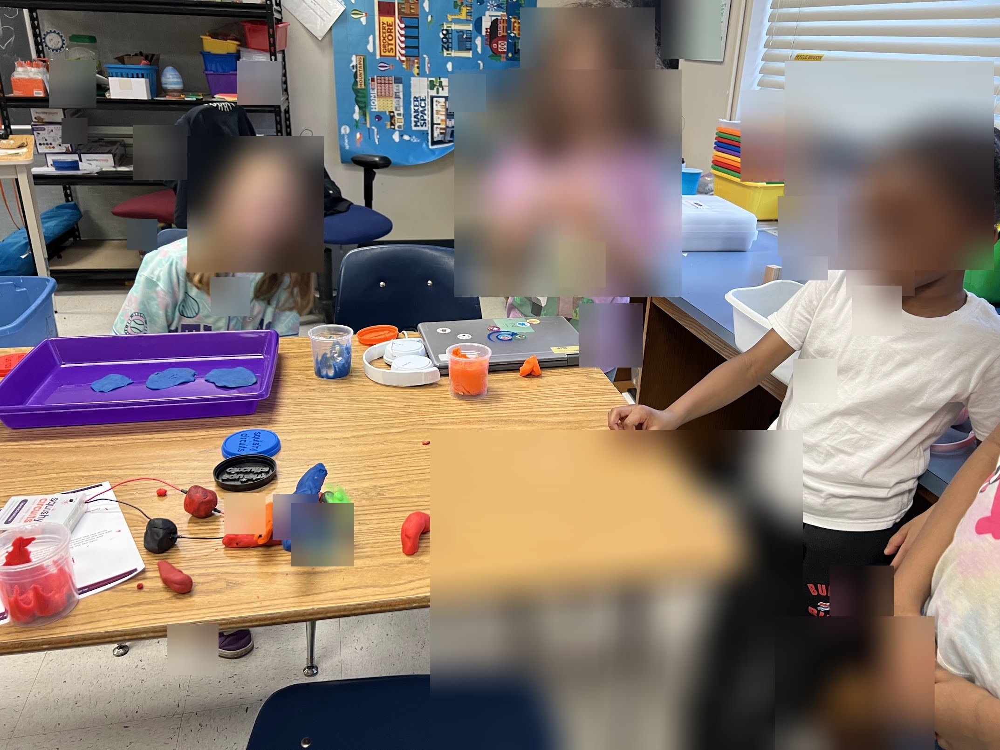
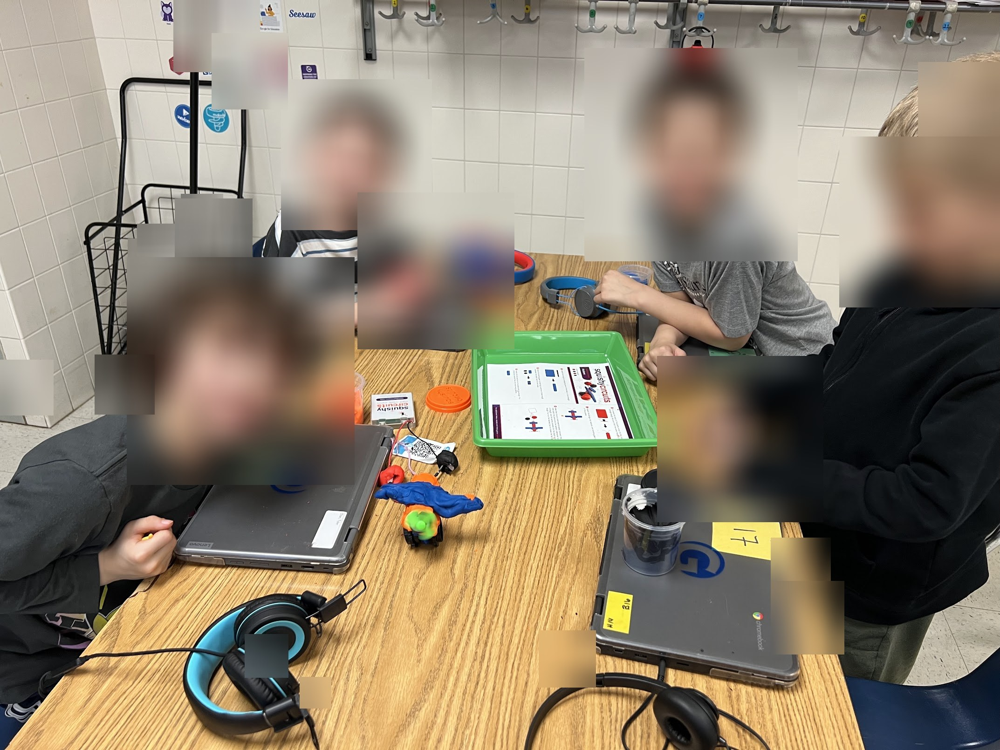
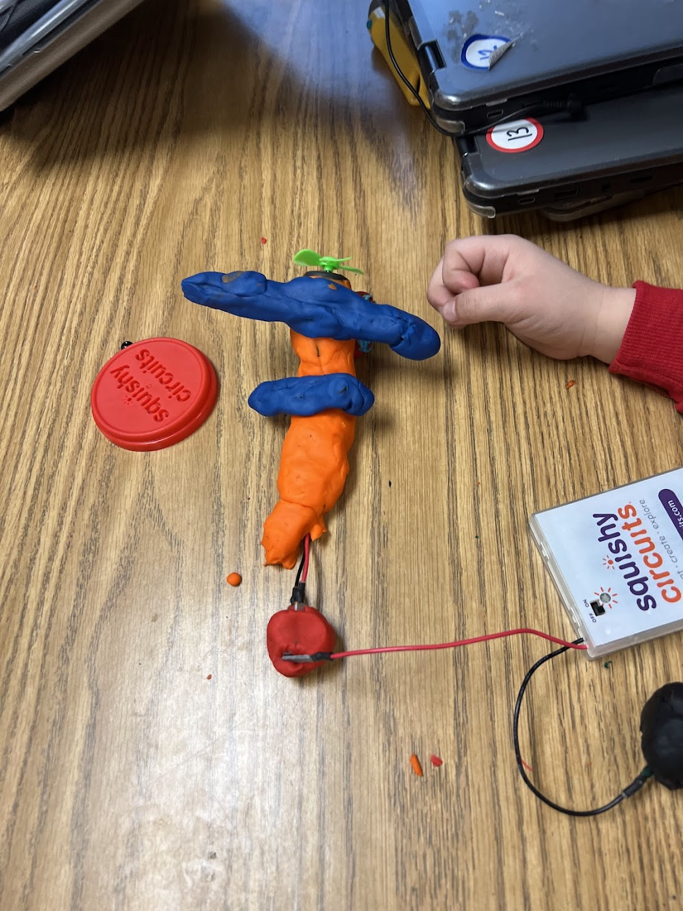
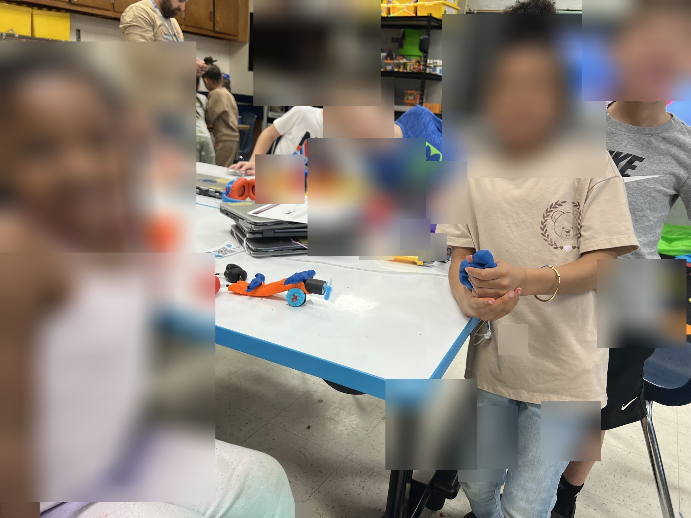
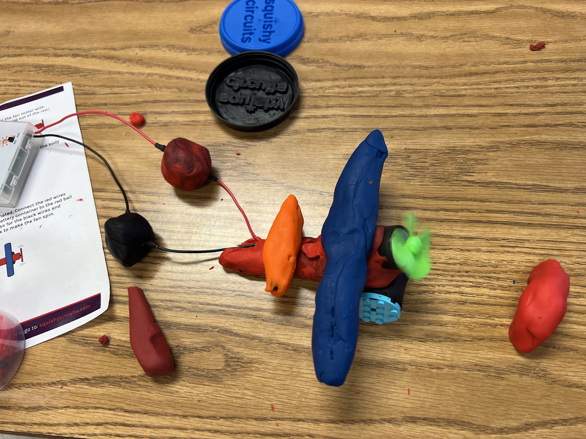
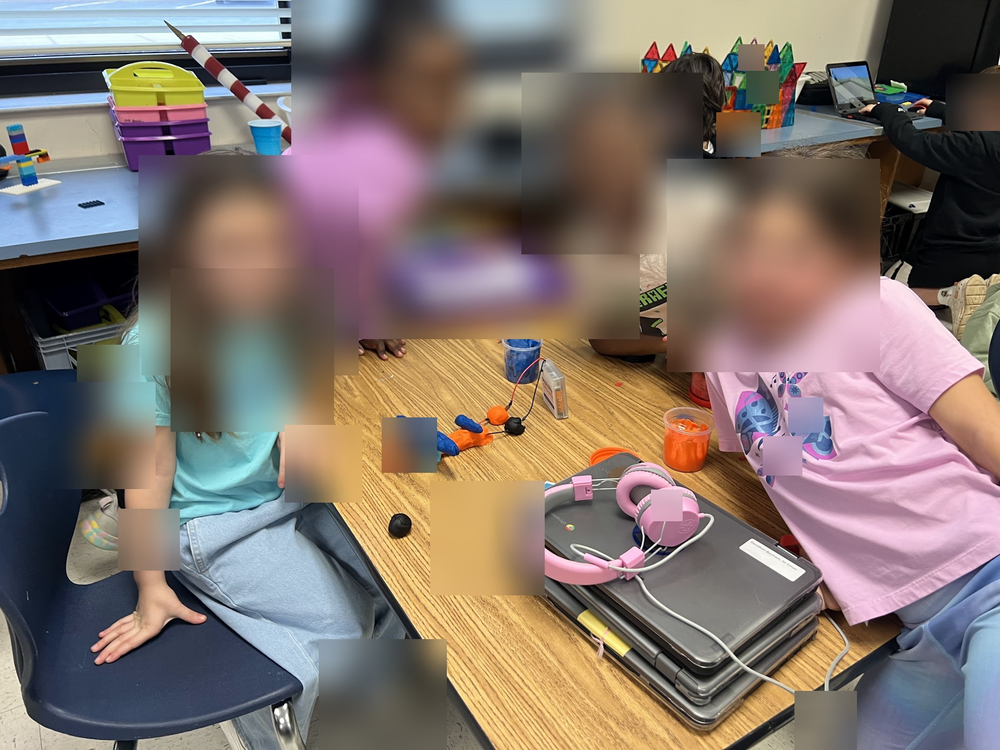
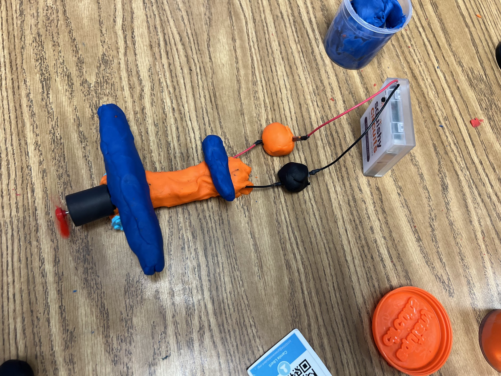
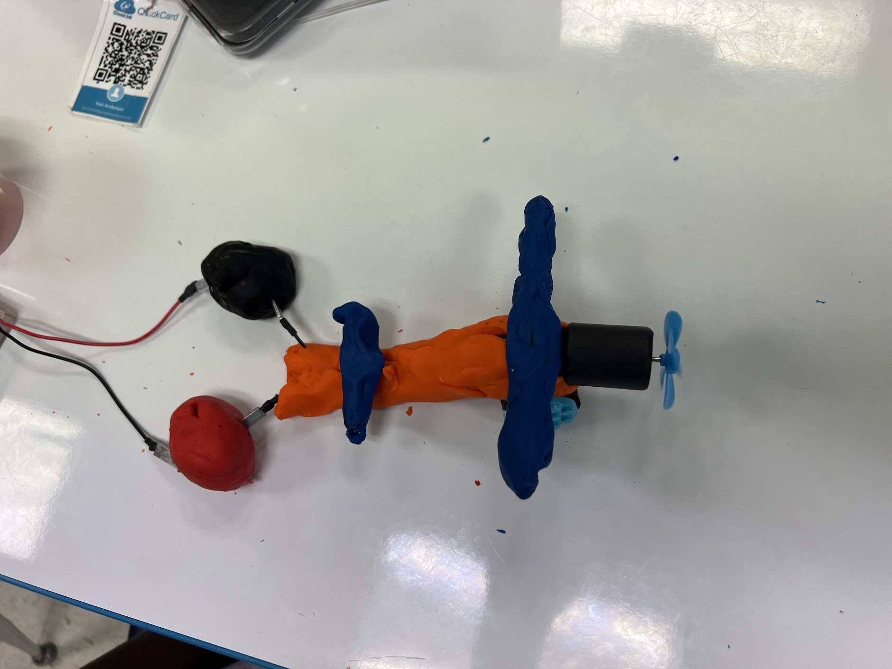
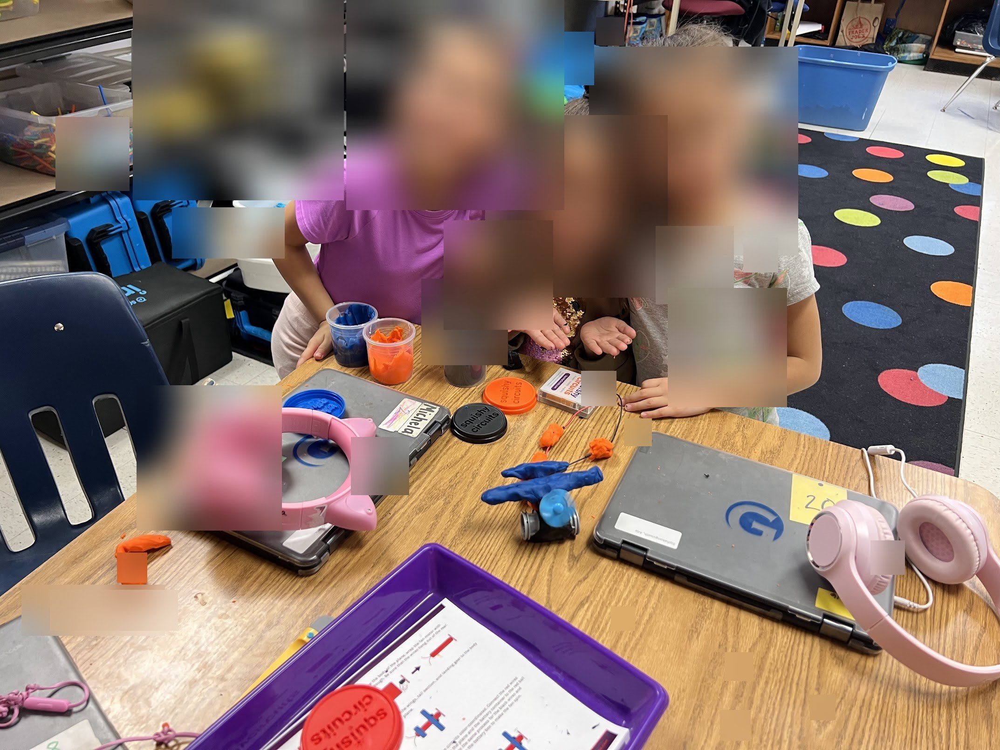

# Module 3 — Joy Evidence From Teaching Placement

**Student:** Piter Zacari Garcia Bautista  
**Course:** EDU498 · Culturally-Historically Responsive Literacies  
**Assignment Connection:** Joy-Oriented Literacy Pursuit  

## Governing Theme

Joy in literacy depends on recognition and access. Students may already be doing rich literacy work through debugging, designing, explaining, collaborating, and revising, but that joy becomes invisible when schools only count traditional reading and writing. A joyful literacy classroom must be designed so students' strengths have real pathways in, and so their multimodal thinking is noticed, valued, and documented.

## Evidence Overview

This document gathers placement evidence for the Joy-Oriented Literacy Pursuit. The goal is not to over-document every moment, but to preserve the strongest examples showing how literacy became joyful, embodied, collaborative, technical, and visible in classroom practice.

| Lesson / Context | Grade | Evidence Focus |
|---|---:|---|
| Minecraft Education Agent Challenge | 4 | Coding, debugging, spatial reasoning, peer teaching, persistence |
| Squishy Circuits Fan / Light Demo | Kindergarten | Vocabulary, physical-digital making, shared countdown, collective success |
| Squishy Circuits Airplane Build | Kindergarten | Design literacy, group roles, schema-building, aesthetic fulfillment |

---

## Example 1 — Debugging as Joyful Persistence

**Lesson / Context:** Minecraft Education Agent Challenge  
**Grade:** 4  
**Evidence Focus:** Coding, debugging, spatial reasoning, persistence

### What happened

A student spent the class period trying to solve a timed dual-plate activation puzzle in Minecraft Education. The task required the student to code an agent to reach one gold plate while the student moved to another. The student failed repeatedly, including wrong turn directions, miscounted steps, and running out of time, but kept resetting, adjusting, and trying again.

### Evidence

> *"You guys got it."*  
> *"Nice, you guys okay perfect."*  
> *"You did a good job."*

### Why this matters

The student was reading directions, interpreting spatial logic, writing code blocks, debugging errors, collaborating with a peer, and revising repeatedly. Every one of those is a literacy act. The joy was not only in finishing; it was in the persistence, feedback loop, and belief that the problem was worth solving.

### What would make it invisible

A traditional literacy assessment would not see this. There is no written paragraph, no book response, and no worksheet. If the teacher does not notice, document, and name this as literacy work, it disappears.

*Students engaged in focused hands-on work — the same persistence and iterative making seen in the Minecraft coding sessions.*

---

## Example 2 — Peer Teaching as Joyful Expertise

**Lesson / Context:** Minecraft Education Agent Challenge  
**Grade:** 4  
**Evidence Focus:** Peer teaching, explanation, community responsibility

### What happened

After one student finished ahead of the group, Piter redirected him into a helper role. The advanced student became a peer teacher, moved toward a classmate's screen, diagnosed the problem, and gave step-by-step guidance. The classmate finished because of that support.

### Evidence

> *"How come you guys are not giving him pointers? You guys are so far."*  
> *"He's gonna help you. That's his job to help you."*  
> *"Out of here you go, baby!"*

### Why this matters

Peer teaching is literacy. Explaining a process requires translating internal understanding into communicable language. The student who taught had to read the problem, assess the peer's code, identify the error, and explain a correction in real time. That is sophisticated communicative literacy.

### What would make it invisible

No traditional rubric captures "explained agent pathfinding to a peer." Without teacher noticing and documentation, this moment of intellectual leadership is lost.

*Students gathered around shared materials — the same peer-support dynamic seen in the Minecraft agent challenge.*

---

## Example 3 — Collaborative Counting as Mathematical Literacy

**Lesson / Context:** Minecraft Education Agent Challenge  
**Grade:** 4  
**Evidence Focus:** Spatial reasoning, counting, mathematical literacy, coding

### What happened

A student could not determine how many steps the agent needed. Piter sat with the student and counted blocks out loud. The student had to interpret a 3D grid, translate it into a number sequence, encode it as code blocks, and test it in real time.

### Evidence

> *"Count with me. One, two, three, four, five, six, seven."*  
> *"So we have six so far. That's assuming that your bot can float."*

### Why this matters

Spatial reasoning, mathematical thinking, and coding are multimodal literacy practices. The counting exchange was a co-constructed literacy event: the student and teacher were reading the digital environment together and converting it into action.

*Hands co-constructing a circuit — the same count-together, build-together dynamic as the spatial reasoning exchange in Minecraft.*

---

## Example 4 — Student-Led Problem Framing

**Lesson / Context:** Minecraft Education Agent Challenge  
**Grade:** 4  
**Evidence Focus:** Inquiry, hypothesis-building, problem framing

### What happened

A student who was stuck on a tree-trunk puzzle narrated the problem out loud. The student read the Minecraft environment, formed a hypothesis, expressed uncertainty, and asked a question.

### Evidence

> *"It's this, it's all of this, and it goes up all the way up there because I need to go through there. That is a trunk?"*

### Why this matters

This was academic inquiry in student language. The student was not only following directions; they were reading an environment, naming a problem, and trying to make sense of a system that mattered to them.

*Student engagement and inquiry energy — the same curiosity and problem-naming visible in the tree-trunk puzzle moment.*

---

## Example 5 — Joy by Design: Collective Circuit Demo

**Lesson / Context:** Squishy Circuits Fan / Light Demo  
**Grade:** Kindergarten  
**Evidence Focus:** Vocabulary, collective participation, embodied science literacy

### What happened

Rather than demonstrating the fan circuit alone, Piter redesigned the lesson so students built it together as a class team. One student per table became the main contributor while the rest of the class served as the support team. Students helped answer questions, correct mistakes, and name the circuit parts in real time.

The contributor role rotated through three jobs:

- one student held the Play-Doh balls as the conductor,
- one connected the cables,
- one controlled the switch.

### Evidence

> *"What do you call something that turns on and off? A switch. There you go."*  
> *"Maybe we can talk to them a little bit about conductors and insulators."*  
> *"Three, two, one — there you go! So let's show this fan, everyone."*

*The fan circuit: battery pack, Play-Doh conductors, wires, and switch — the created literacy object from the collective demo.*

### Why this matters

The countdown to turning on the fan was collective anticipation. The fan turning on was a shared payoff: every student had contributed to making it happen. Students generated vocabulary, read a physical circuit, built a causal model, and participated orally and physically.

### Teaching move

This was a deliberate redesign. The original plan was a standard demo. Piter changed the approach so collective success, not individual performance, became the entry point to the material. That is joy by design: belonging before building, shared accomplishment before solo production.

*Students gathered at the table for the Squishy Circuits demonstration — belonging before building.*

---

## Example 6 — Joy as Making: Squishy Circuits Airplane Build

**Lesson / Context:** Squishy Circuits Airplane Build  
**Grade:** Kindergarten  
**Evidence Focus:** Design literacy, group roles, schema-building, aesthetic fulfillment

### What happened

The airplane-building lesson followed a three-part instructional arc:

1. **Team demo with contributor model** — students first built shared conceptual knowledge through the class fan/light demo.
2. **Schema-building through video and naming** — students watched how the airplane would be built and named parts such as body, wing, fan, motor, and Play-Doh.
3. **Small-group airplane build** — students worked in groups to build their own squishy circuit airplanes, applying the vocabulary, sequence, and materials from the demo.

*Overhead view: finished airplane, battery pack, circuit wiring, and instruction card — the full material set students worked with.*

### Evidence

> *"We're gonna show you a video on how to build the airplane. And then when we come next class, we're just gonna jump to it."*  
> *"This is the body of the airplane..."*  
> *"The winner, the one that does it — that does a good job, a good and a clean job — is gonna have a reward."*

*Finished squishy circuit airplane — orange body, blue wings, fan motor with propeller. The final artifact students built.*

### Why this matters

The airplane build required students to read a model, follow a construction sequence, use scientific vocabulary in context, collaborate in a small group, and evaluate their own work against a quality standard. This was a complete multimodal literacy event for kindergarteners.

### Teaching move

The three-part design — collective demo, schema video, then small-group build — front-loaded belonging and understanding before asking students to produce. That made the independent production phase joyful rather than stressful.

*Students with their completed squishy circuit airplane — aesthetic fulfillment and shared pride after the three-part build arc.*

---

## Source Index

| Source | Grade | What it documents |
|---|---:|---|
| [Grade 4 Minecraft Agent Challenge transcript](grade-4-minecraft-agent-challenge-evidence.md) | 4 | Examples 1–4: Minecraft coding, debugging, counting, peer teaching |
| [Kindergarten Circuit Demo / Play-Doh Airplane Prep transcript](kindergarten-circuit-demo-airplane-prep-evidence.md) | K | Examples 5–6: fan/light demo, vocabulary, airplane build preparation |
| Squishy Circuits airplane build photos | K | Example 6: small-group build, finished product, aesthetic fulfillment |

---

## Final Use for Joy-Oriented Literacy Pursuit

This evidence supports the assignment because it shows that the literacy pursuit was not only a written reflection. It was a classroom-based project shared with an authentic audience: students. The project embodied joy, love, and aesthetic fulfillment through collective problem-solving, physical-digital design, peer teaching, vocabulary development, and visible success.
